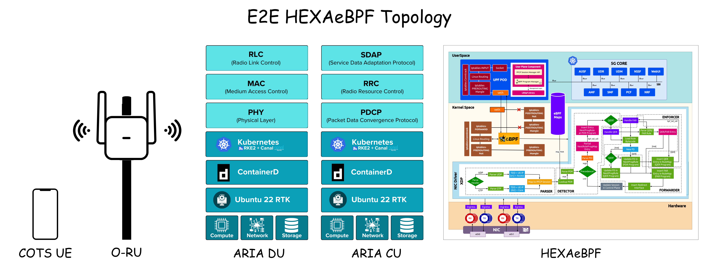

<table style="border-collapse: collapse; border: none;">
  <tr style="border-collapse: collapse; border: none;">
    <td style="border-collapse: collapse; border: none;">
      <a href="http://www.coranlabs.com/">
         
         </img>
      </a>
    </td>
    <td style="border-collapse: collapse; border: none; vertical-align: center;">
      <b><font size = "5">Introduction to HEXAeBPF</font></b>
    </td>
  </tr>
</table>

**TABLE OF CONTENTS**

- [HEXAeBPF](#hexaebpf)
  - [Introduction](#introduction)
  - [Need](#need)
    - [Features](#features)
- [HEXAeBPF Design Principles](#hexaebpf-design-principles)
  - [Control Plane](#control-plane)
  - [User Plane](#user-plane)
  - [User Space Layer](#user-space-layer)
  - [Kernel Space Layer](#kernel-space-layer)
  - [HEXA_UPF: Brief Functional Description](#hexa_upf-brief-functional-description)
- [HEXAeBPF E2E Setup](#hexaebpf-e2e-setup)
  - [HEXAeBPF Deployment](#hexaebpf-deployment)
  - [E2E Connectivity Test via RAN Simulators](#e2e-connectivity-test-via-ran-simulators)
    - [UERANSIM Simulator](#ueransim-simulator)
    - [GNBSIM Simulator](#gnbsim-simulator)
    - [Packet Rusher Simulator](#packet-rusher-simulator)
- [HEXAeBPF Logs](#hexaebpf-logs)
  - [HEXA_AMF Logs](#hexa_amf-logs)
  - [HEXA_UPF Logs](#hexa_upf-logs)
- [Roadmap](#roadmap)
  - [Benchmarking HEXA_UPF](#benchmarking-hexa_upf)
  - [Integrations with Other Open Source Projects](#integrations-with-other-open-source-projects)
  - [Flexibility to Run with Any Open Source 5G Core](#flexibility-to-run-with-any-open-source-5g-core)
- [License](#license)
- [Contribution](#contribution)

## HEXAeBPF

### Introduction

HEXAeBPF is an open-source, eBPF-defined, cloud-native telecom solution designed to create an integrated ecosystem leveraging multiple open-source tools. It is compatible with 5G, beyond 5G, and advanced 5G/6G technologies. HEXAeBPF offers unparalleled flexibility and scalability, optimizing the allocation of network resources and seamlessly accommodating emergent use cases. It enhances the inherent connectivity of 5G NFs while fine-tuning network, security, service, and scheduling aspects. Through eBPF's monitoring and packet control features, HEXAeBPF augments the service capabilities of components, thereby improving encrypted data transmission. Real-time monitoring, eBPF-driven load balancing, and increased transmission efficiency contribute to reduced latency and alleviation of latency anomalies compared to conventional platforms. This granular compartmentalization facilitates dynamic orchestration, optimizing the allocation of network resources and seamlessly accommodating emergent use cases.

### Need

Built on the foundation of eBPF, HEXAeBPF offers unparalleled performance, scalability, and flexibility for your network. 

#### Features

- Reducing CPU/Memory usage
- Low Latency
- Decreased Packet Loss
- Enhanced Scalability
- Improved Performance and Observability
- Maximized UL and DL Throughput
- In-Kernel Fast Packet Processing
- Flexible Dataplane
- XDP-Based Traffic Handling
- Network Performance Analysis
- User Plane Application Profiling
- Improving UPF Efficiency
- Interaction between eBPF and End-Host Networking in User Plane
- High-Performance Networking
- Lifecycle Management of eBPF Programs
- Network Slicing
- NMS Dashboard

## HEXAeBPF Design Principles


### Control Plane

HEXAeBPF Control Plane is built on top of [Aether/SDCore](https://opennetworking.org/sd-core/) (LF Project), ensuring support for 5G Standalone networks. This design provides the necessary flexibility for various network configurations, enhancing the overall adaptability and performance of the system.

### User Plane

HEXAeBPF features an in-house User Plane Function (HEXA-UPF) with all functionalities implemented in the kernel through eBPF programs. These programs handle data packets at the Data Link Layer, optimizing performance by shifting Packet Forwarding Control Protocol (PFCP) filtering rules (PDR, FAR, QER) to the kernel's XDP hook. This approach improves packet filtering efficiency and offloads processing from the CPU to the kernel, significantly reducing CPU and memory usage.

### User Space Layer

The user space layer has a functional component that manages control plane sessions and another function attaches BPF programs to the respective interfaces via BPF skeletons that are responsible for setting up the UE pipeline using eBPF programs via rawlink. It provides functionality to handle requests such as PFCP association, modification, and deletion along with continuous heartbeats to health check connections between user plane and control plane. The control plane session messages handling currently supports session association that involves control plane and user plane initial context setup via exchanging their node IDs and establishing an initial UPF context setup. eBPF programs extensively use BPF maps, which are special data structures that reside in kernel memory and can be shared between the kernel and user space. Here, BPF Maps save the context of session messages.

### Kernel Space Layer

In the kernel space layer, the eBPF programs handle the UE traffic pipeline at the eXpress Data Path (XDP) hook, which is the closest to the NIC driver just after interrupt processing. The eBPF programs attached at the XDP hook initially parse the UE packet and based on the packet’s IE it matches the PDRs with the highest precedence. Here, the UE traffic is classified into uplink (GTP) or downlink (UDP) traffic. If it is a GTPu packet, the TEID is used to get PFCP session context whereas if it is a UDP packet the UE IP address pool is used to get PFCP session context from eBPF maps. Furthermore, the BPF program performs the initial PFCP session lookup and finds the PFCP session then it applies other action rules present in eBPF maps, associated with the PDR, and it is applied by the tail calling feature of the eBPF program that leverages BPF program code limits. The tail-called BPF program, loaded by the handler function, then matches the QoS Enforcement rules i.e., QER that are used for rate scheduling of UE traffic using BPF maps. Ultimately, the forwarding action rule is applied using the FAR_ID from the PDR referencing the FAR that is stored in a BPF hashmap. The FAR performs the modification of the UE packets for outer header creation and the destination interface. After this, the forwarder accesses the BPF maps to check the MAC address of the next hop and the index of the destination interface where the packet will be redirected. This routing is imported from the kernel routing tables.

### HEXA_UPF: Brief Functional Description


#### Brief

The diagram represents the function of the User Plane Function (UPF) in a mobile network. The UPF is responsible for handling data packets as they pass through the network. Here’s a detailed breakdown of the UPF's workflow based on the provided diagram:

1. **Parser Module:**

- Packet Entry: The process begins when a new packet (uplink or downlink) arrives at the UPF. The packet header is parsed to determine whether it uses the GTP (GPRS Tunneling Protocol) or UDP (User Datagram Protocol).

- GTP Parsing: If the packet uses GTP, it undergoes GTP parsing. Key identifiers, such as TEID (Tunnel Endpoint Identifier) and UE IP (User Equipment IP), along with the access type, are extracted.

- UDP Parsing: If the packet uses UDP, it undergoes UDP parsing. Key identifiers, such as TEID and UE IP, along with the core network type, are extracted.

2. **Detector Module:**

- PDR Mapping: The session mapping triggers the lookup of a corresponding PDR (Packet Detection Rule). The PDR is parsed to retrieve specific rules and parameters. The precedence of the rule is checked to determine processing order.

- PDI Parsing: If the precedence is low, PDI (Packet Detection Information) is checked and parsed. A bpf_tail_call is invoked to enter a partial next prog rule Map entry. A new entry is inserted into the next program at the PDR program level. A check is performed to see if there is a QER (QoS Enforcement Rule).

3. **Forwarder and Enforcer Modules:**

- QER Handling: If there is no QER, the FAR (Forwarding Action Rule) is handled. The FAR rule is parsed, and the corresponding rule bytecode is loaded. A new FAR entry and FD (Forwarding Descriptor) are created. The FD is updated in the NextProgRule at the PDR program level. The FAR entry is inserted into the RuleMap at the FAR program level. A redirect interface is inserted if necessary.

4. **Final Steps:** The session is updated in the control plane. This update reflects any changes made during the packet processing, such as new rules or modified forwarding actions.

## HEXAeBPF E2E Setup

### HEXAeBPF Deployment



HEXAeBPF has already been successfully tested with:

#### RAN
- ARIA(CoRanLabs)
- OAI
- srsRAN

#### Commercial RU
- LiteOn
- Benetel

#### Simulators
- UERANSIM
- Gnbsim

#### COTS UE
- Samsung S22
- Samsung S21FE
- MotoG51 5G
- OnePlus 11 5G
- APAL MiFi

### Pre-requisites

#### HEXA_UPF Pre-requisites

- Git
- make
- gcc
- libbpf-dev
- Clang
- LLVM
- cmake
- kernel version >= v5.15

### Control Plane NFs Configuration

#### SMF

```yaml
smf:
  deploy: true
  podAnnotations:
    field.cattle.io/workloadMetrics: '[{"path":"/metrics","port":9089,"schema":"HTTP"}]'
  serviceType: ClusterIP
  upfPort: 8805
  n4:
    port: 8805
  prometheus:
    port: 9089
  sbi:
    port: 29502
  cfgFiles:
    uerouting.conf:
      info:
        version: 1.0.0
        description: Routing information for UE
    smfcfg.conf:
      info:
        version: 1.0.0
        description: SMF initial local configuration
      configuration:
        smfDBName: sdcore_smf
        enableDBStore: false
        enableNrfCaching: false
        debugProfilePort: 5001
        kafkaInfo:
          brokerUri: "kafka-headless"
          brokerPort: 9092
          topicName: "sdcore-data-source-smf"
        pfcp:
          addr: "POD_IP"
        smfName: SMF
        nrfUri: http://nrf:29510
        sbi:
          scheme: http
          bindingIPv4: "0.0.0.0"
          registerIPv4: smf
        serviceNameList:
          - nsmf-pdusession
          - nsmf-event-exposure
        snssaiInfos:
          - dnnInfos:
            - dnn: "internet"
              dns:
                ipv4: "8.8.8.8"
                ipv6: "2001:4860:4860::8888"
              ueSubnet: 172.250.0.0/16
            sNssai:
              sd: "010203"
              sst: 1
        userplane_information:
          up_nodes:
            gNB1:
              type: AN
            UPF:
              type: UPF
              node_id: upf
              sNssaiUpfInfos:
                - sNssai:
                    sst: 1
                    sd: "010203"
                  dnnUpfInfoList:
                    - dnn: "internet"
                  plmnId:
                    mcc: "208"
                    mnc: "93"
                - sNssai:
                    sst: 1
                    sd: "112233"
                  dnnUpfInfoList:
                    - dnn: "internet"
                  plmnId:
                    mcc: "208"
                    mnc: "93"
              interfaces:
                - interfaceType: N3
                  endpoints:
                    - upf
                  networkInstance: internet
          links:
            - A: gNB1
              B: UPF
```

#### AMF

```yaml
amf:
  deploy: true
  podAnnotations:
    field.cattle.io/workloadMetrics: '[{"path":"/metrics","port":9089,"schema":"HTTP"}]'
  serviceType: ClusterIP
  prometheus:
    port: 9089
  sctp_grpc:
    port: 9000
  sbi:
    port: 29518
  ngapp:
    port: 38412
  cfgFiles:
    amfcfg.conf:
      info:
        version: 1.0.0
        description: AMF initial configuration
      configuration:
        amfDBName: sdcore_amf
        enableDBStore: false
        enableNrfCaching: false
        debugProfilePort: 5001
        kafkaInfo:
          brokerUri: "kafka-headless"
          brokerPort: 9092
          topicName: "sdcore-data-source-amf"
        ngapIpList:
          - "0.0.0.0"
        amfName: AMF
        nrfUri: http://nrf:29510
        sbi:
          scheme: http
          bindingIPv4: "0.0.0.0"
          registerIPv4: amf
        serviceNameList:
          - namf-comm
          - namf-evts
          - namf-mt
          - namf-loc
          - namf-oam
        servedGuamiList:
          - plmnId:
              mcc: "208"
              mnc: "93"
            amfId: cafe00
        supportTaiList:
          - plmnId:
              mcc: "208"
              mnc: "93"
            tac: 1
        plmnSupportList:
          - plmnId:
              mcc: "208"
              mnc: "93"
            snssaiList:
              - sst: 1
                sd: "010203"
        supportDnnList:
          - internet
        security:
          integrityOrder:
            - NIA1
            - NIA2
          cipheringOrder:
            - NEA0
        networkName:
          full: Aether5G
          short: Aether
        networkFeatureSupport5GS:
          enable: true
          imsVoPS: 0
          emc: 0
          emf: 0
          iwkN26: 0
          mpsi: 0
          emcN3: 0
          mcsi: 0
        t3502Value: 720
        t3512Value: 3600
        non3gppDeregistrationTimerValue: 3240
        t3513:
          enable: true
          expireTime: 6s
          maxRetryTimes: 4
        t3522:
          enable: true
          expireTime: 6s
          maxRetryTimes: 4
        t3550:
          enable: true
          expireTime: 6s
          maxRetryTimes: 4
        t3560:
          enable: true
          expireTime: 6s
          maxRetryTimes: 4
        t3565:
          enable: true
          expireTime: 6s
          maxRetryTimes: 4
```

#### NRF

```yaml
nrf:
  deploy: true
  serviceType: ClusterIP
  sbi:
    port: 29510
  cfgFiles:
    nrfcfg.conf:
      info:
        version: 1.0.0
        description: NRF initial local configuration
      configuration:
        mongoDBStreamEnable: true
        nfProfileExpiryEnable: true
        nfKeepAliveTime: 60
        sbi:
          scheme: http
          bindingIPv4: "0.0.0.0"
          registerIPv4: nrf
        DefaultPlmnId:
          mcc: "208"
          mnc: "93"
        serviceNameList:
          - nnrf-nfm
          - nnrf-disc
```

#### AUSF

```yaml
ausf:
  deploy: true
  serviceType: ClusterIP
  sbi:
    port: 29509
  cfgFiles:
    ausfcfg.conf:
      info:
        version: 1.0.0
        description: AUSF initial local configuration
      configuration:


        nrfUri: http://nrf:29510
        sbi:
          scheme: http
          bindingIPv4: "0.0.0.0"
          registerIPv4: ausf
        serviceNameList:
          - nausf-auth
        plmnSupportList:
          - mcc: "208"
            mnc: "93"
        groupId: ausfGroup001
```

#### NSSF

```yaml
nssf:
  deploy: true
  serviceType: ClusterIP
  sbi:
    port: 29531
  cfgFiles:
    nssfcfg.conf:
      info:
        version: 1.0.0
        description: NSSF initial local configuration
      configuration:
        nssfName: NSSF
        nrfUri: http://nrf:29510
        sbi:
          scheme: http
          bindingIPv4: "0.0.0.0"
          registerIPv4: nssf
        serviceNameList:
          - nnssf-nsselection
          - nnssf-nssaiavailability
        supportedPlmnList:
          - mcc: "208"
            mnc: "93"
        supportedNssaiInPlmnList:
          - plmnId:
              mcc: "208"
              mnc: "93"
            supportedSnssaiList:
              - sst: 1
                sd: "010203"
        nsiList:
          - snssai:
              sst: 1
              sd: "010203"
            nsiInformationList:
              - nrfId: http://nrf:29510/nnrf-nfm/v1/nf-instances
                nsiId: 22
```

#### PCF

```yaml
pcf:
  deploy: true
  serviceType: ClusterIP
  sbi:
    port: 29507
  cfgFiles:
    pcfcfg.conf:
      info:
        version: 1.0.0
        description: PCF initial local configuration
      configuration:
        pcfName: PCF
        nrfUri: http://nrf:29510
        sbi:
          scheme: http
          bindingIPv4: "0.0.0.0"
          registerIPv4: pcf
        defaultBdtRefId: BdtPolicyId-
        plmnList:
          - plmnId:
              mcc: "208"
              mnc: "93"
          - plmnId:
              mcc: "333"
              mnc: "88"
        serviceList:
          - serviceName: npcf-am-policy-control
          - serviceName: npcf-smpolicycontrol
            suppFeat: 3fff
          - serviceName: npcf-bdtpolicycontrol
          - serviceName: npcf-policyauthorization
            suppFeat: 3
          - serviceName: npcf-eventexposure
          - serviceName: npcf-ue-policy-control
```

#### UDR

```yaml
udr:
  deploy: true
  serviceType: ClusterIP
  sbi:
    port: 29504
  cfgFiles:
    udrcfg.conf:
      info:
        version: 1.0.0
        description: UDR initial local configuration
      configuration:
        nrfUri: http://nrf:29510
        plmnSupportList:
          - plmnId:
              mcc: "208"
              mnc: "93"
          - plmnId:
              mcc: "333"
              mnc: "88"
        sbi:
          scheme: http
          bindingIPv4: "0.0.0.0"
          registerIPv4: udr
```

#### UDM

```yaml
udm:
  deploy: true
  serviceType: ClusterIP
  sbi:
    port: 29503
  cfgFiles:
    udmcfg.conf:
      info:
        version: 1.0.0
        description: UDM initial local configuration
      configuration:
        nrfUri: http://nrf:29510
        plmnList:
          - plmnId:
              mcc: "208"
              mnc: "93"
          - plmnId:
              mcc: "222"
              mnc: "88"
        serviceNameList:
          - nudm-sdm
          - nudm-uecm
          - nudm-ueau
          - nudm-ee
          - nudm-pp
        sbi:
          scheme: http
          bindingIPv4: "0.0.0.0"
          registerIPv4: udm
          tls:
            log: free5gc/udmsslkey.log
            pem: free5gc/support/TLS/udm.pem
            key: free5gc/support/TLS/udm.key
        keys:
          udmProfileAHNPublicKey: 5a8d38864820197c3394b92613b20b91633cbd897119273bf8e4a6f4eec0a650
          udmProfileAHNPrivateKey: c53c22208b61860b06c62e5406a7b330c2b577aa5558981510d128247d38bd1d
          udmProfileBHNPublicKey: 0472DA71976234CE833A6907425867B82E074D44EF907DFB4B3E21C1C2256EBCD15A7DED52FCBB097A4ED250E036C7B9C8C7004C4EEDC4F068CD7BF8D3F900E3B4
          udmProfileBHNPrivateKey: F1AB1074477EBCC7F554EA1C5FC368B1616730155E0041AC447D6301975FECDA
```

#### Web UI

```yaml
webui:
  deploy: true
  serviceType: ClusterIP
  urlport:
    port: 5000
  grpc:
    port: 9876
  ingress:
    enabled: false
    hostname: free5gc.local
    path: /
    pathType: Prefix
  cfgFiles:
    webuicfg.conf:
      info:
        version: 1.0.0
        description: WebUI initial local configuration
      configuration:
        spec-compliant-sdf: false
```


### User Plane NF Configuration

#### HEXA_UPF

```yaml
configMaps:
  config:
    data:
      config.yml: |
        interface_name: [access, eth0, core]
        api_address: :8080
        pfcp_address: PFCP_ADDRESS:8805
        metrics_address: :9090
        n3_address: 192.168.252.3

podAnnotations:
  k8s.v1.cni.cncf.io/networks: |
    [
      { "name": "access-net",
        "interface": "access",
        "ips": [ "192.168.252.3/24" ],
        "mac": "d6:a4:06:a6:45:6f",
        "dns": {}
      },
      { "name": "core-net",
        "interface": "core",
        "ips": [ "192.168.250.3/24" ],
        "mac": "f6:2b:4f:38:e8:49",
        "dns": {}
      }
    ]
```

### Deploying HEXAeBPF

```bash
# Start with a fresh system
make clean

# Copy cord directory to home directory
tar -zxvf cord.tgz
cp -r cord ~/

# This will deploy core
DATA_IFACE=eth0 make hexa

# This will deploy hexaupf
make hexaupf

# To clean only core
make hexa-clean

# To clean everything
make clean
```

#### Check if everything is up and running

```txt
hexaebpf:~ $ kubectl get pod -n hexa
NAME                          READY   STATUS    RESTARTS   AGE
hexa-amf-84c576fbc5-kjmzb     1/1     Running   0          5h48m
hexa-ausf-7f8ff65c54-kst7h    1/1     Running   0          5h48m
hexa-core-zookeeper-0         1/1     Running   0          5h48m
hexa-nrf-5f85dbdd98-bf5nk     1/1     Running   0          5h48m
hexa-nssf-7849d565d5-4k9w2    1/1     Running   0          5h48m
hexa-pcf-bfb558c64-gxvg9      1/1     Running   0          5h48m
hexa-smf-644944476b-fvcv5     1/1     Running   0          5h
hexa-udm-664b786dd6-fnbpz     1/1     Running   0          5h48m
hexa-udr-57dc97c5d8-vd8v5     1/1     Running   0          5h48m
hexa-upf-7d4f98f97b-hdclp     1/1     Running   0          5m23s
kafka-0                       1/1     Running   0          5h47m
metricfunc-5dbc48f86f-9n98h   1/1     Running   0          5h48m
mongodb-0                     1/1     Running   0          5h47m
mongodb-1                     1/1     Running   0          5h47m
mongodb-arbiter-0             1/1     Running   0          5h47m
simapp-54c7f7989c-gcdhr       1/1     Running   0          5h48m
webui-66dd7fd9fb-9bb7q        1/1     Running   0          5h48m
```

## E2E Connectivity Test via RAN Simulators

### UERANSIM Simulator

#### Starting GNB

```log
sudo ../build/nr-gnb -c hexaebpf-gnb.yaml 
[2024-05-11 08:28:52.928] [sctp] [info] Trying to establish SCTP connection... (192.168.1.246:38412)
[2024-05-11 08:28:52.931] [sctp] [info] SCTP connection established (192.168.1.246:38412)
[2024-05-11 08:28:52.931] [sctp] [debug] SCTP association setup ascId[4]
[2024-05-11 08:28:52.932] [ngap] [debug] Sending NG Setup Request
[2024-05-11 08:28:52.936] [ngap] [debug] NG Setup Response received
[2024-05-11 08:28:52.936] [ngap] [info] NG Setup procedure is successful
[2024-05-11 08:29:01.860] [rrc] [debug] UE[1] new signal detected
[2024-05-11 08:29:01.860] [rrc] [info] RRC Setup for UE[1]
[2024-05-11 08:29:01.860] [ngap] [debug] Initial NAS message received from UE[1]
[2024-05-11 08:29:02.263] [ngap] [debug] Initial Context Setup Request received
[2024-05-11 08:29:02.659] [ngap] [info] PDU session resource(s) setup for UE[1] count[1]
```

#### Starting UE

```log
sudo ../build/nr-ue -c hexaebpf-ue.yaml 
[2024-05-11 08:29:01.860] [nas] [info] UE switches to state [MM-DEREGISTERED/PLMN-SEARCH]
[2024-05-11 08:29:01.860] [rrc] [debug] New signal detected for cell[1], total [1] cells in coverage
[2024-05-11 08:29:01.860] [nas] [info] Selected plmn[001/01]
[2024-05-11 08:29:01.860] [rrc] [info] Selected cell plmn[001/01] tac[1] category[SUITABLE]
[2024-05-11 08:29:01.860] [nas] [info] UE switches to state [MM-DEREGISTERED/PS]
[2024-05-11 08:29:01.860] [nas] [info] UE switches to state [MM-DEREGISTERED/NORMAL-SERVICE]
[2024-05-11 08:29:01.860] [nas] [debug] Initial registration required due to [MM-DEREG-NORMAL-SERVICE]
[2024-05-11 08:29:01.860] [nas] [debug] UAC access attempt is allowed for identity[0], category[MO_sig]
[2024-05-11 08:29:01.860] [nas] [debug] Sending Initial Registration
[2024-05-11 08:29:01.860] [nas] [info] UE switches to state [MM-REGISTER-INITIATED]
[2024-05-11 08:29:01.860] [rrc] [debug] Sending RRC Setup Request
[2024-05-11 08:29:01.860] [rrc] [info] RRC connection established
[2024-05-11 08:29:01.860] [rrc] [info] UE switches to state [RRC-CONNECTED]
[2024-05-11 08:29:01.860] [nas] [info] UE switches to state [CM-CONNECTED]
[2024-05-11 08:29:01.960] [nas] [debug] Authentication Request received
[2024-05-11 08:29:01.960] [nas] [debug] Received SQN [16F3B3F70FC2]
[2024-05-11 08:29:01.960] [nas] [debug] SQN-MS [000000000000]
[2024-05-11 08:29:01.960] [nas] [debug] Sending Authentication Failure due to SQN out of range
[2024-05-11 08:29:01.988] [nas] [debug] Authentication Request received
[2024-05-11 08:29:01.988] [nas] [debug] Received SQN [000000000021]
[2024-05-11 08:29:01.988] [nas] [debug] SQN-MS [000000000000]
[2024-05-11 08:29:02.072] [nas] [debug] Security Mode Command received
[2024-05-11 08:29:02.072] [nas] [debug] Selected integrity[1] ciphering[0]
[2024-05-11 08:29:02.264] [nas] [debug] Registration accept received
[2024-05-11 08:29:02.264] [nas] [info] UE switches to state [MM-REGISTERED/NORMAL-SERVICE]
[2024-05-11 08:29:02.264] [nas] [debug] Sending Registration Complete
[2024-05-11 08:29:02.264] [nas] [info] Initial Registration is successful
[2024-05-11 08:29:02.264] [nas] [debug] Sending PDU Session Establishment Request
[2024-05-11 08:29:02.264] [nas] [debug] UAC access attempt is allowed for identity[0], category[MO_sig]
[2024-05-11 08:29:02.660] [nas] [debug] PDU Session Establishment Accept received
[2024-05-11 08:29:02.660] [nas] [info] PDU Session establishment is successful PSI[1]
[2024-05-11 08:29:02.672] [app] [info] Connection setup for PDU session[1] is successful, TUN interface[uesimtun0, 172.250.237.121] is up.
```
> Check out `hexaebpf-ue.yaml` and `hexaebpf-gnb.yaml` [here](./docs/config/UERANSIM)

### GNBSIM Simulator

> Coming soon...


### Packet Rusher Simulator

> Coming soon...

## HEXAeBPF Logs

### HEXA_AMF Logs

```log
2024-06-12T08:58:43Z [INFO][HEXA_AMF][App] ========================================
2024-06-12T08:58:43Z [INFO][HEXA_AMF][App] ##############|HEXA AMF|###############
2024-06-12T08:58:43Z [INFO][HEXA_AMF][App] ========================================
...
2024-06-12T09:00:04Z [INFO][CONN][GRPC] +---------------------------------------------+
2024-06-12T09:00:04Z [INFO][CONN][GRPC] | Network Slice                               |
2024-06-12T09:00:04Z [INFO][CONN][GRPC] |---------------------------------------------|
2024-06-12T09:00:04Z [INFO][CONN][GRPC] | Name                | hexa-slice-01         |
2024-06-12T09:00:04Z [INFO][CONN][GRPC] | Sst                 | 1                     |
2024-06-12T09:00:04Z [INFO][CONN][GRPC] | Sd                  | 010203                |
2024-06-12T09:00:04Z [INFO][CONN][GRPC] |---------------------------------------------|
2024-06-12T09:00:04Z [INFO][CONN][GRPC] | Device Group        | 5g-ue-01              |
2024-06-12T09:00:04Z [INFO][CONN][GRPC] | IP Domain Details   | pool1                 |
2024-06-12T09:00:04Z [INFO][CONN][GRPC] | DNN Name            | hexa                  |
2024-06-12T09:00:04Z [INFO][CONN][GRPC] | UE Pool             | 172.250.1.0/16        |
2024-06-12T09:00:04Z [INFO][CONN][GRPC] | DNS Primary         | 8.8.8.8               |
2024-06-12T09:00:04Z [INFO][CONN][GRPC] | MTU                 | 1460                  |
2024-06-12T09:00:04Z [INFO][CONN][GRPC] | DnnMbrUplink        | 20000000              |
2024-06-12T09:00:04Z [INFO][CONN][GRPC] | DnnMbrDownlink      | 200000000             |
2024-06-12T09:00:04Z [INFO][CONN][GRPC] | Traffic Class       | platinum              |
2024-06-12T09:00:04Z [INFO][CONN][GRPC] |                     | 001010100007487       |
2024-06-12T09:00:04Z [INFO][CONN][GRPC] |                     | 001010100007488       |
2024-06-12T09:00:04Z [INFO][CONN][GRPC] |                     | 001010100007489       |
2024-06-12T09:00:04Z [INFO][CONN][GRPC] |                     | 001010100007490       |
2024-06-12T09:00:04Z [INFO][CONN][GRPC] |                     | 001010100007491       |
2024-06-12T09:00:04Z [INFO][CONN][GRPC] |                     | 001010100007492       |
2024-06-12T09:00:04Z [INFO][CONN][GRPC] |                     | 001010100007401       |
2024-06-12T09:00:04Z [INFO][CONN][GRPC] | IMSI_LIST           | 001010100007494       |
2024-06-12T09:00:04Z [INFO][CONN][GRPC] |                     | 001010100007495       |
2024-06-12T09:00:04Z [INFO][CONN][GRPC] |                     | 001010100007496       |
2024-06-12T09:00:04Z [INFO][CONN][GRPC] |                     | 001010100007497       |
2024-06-12T09:00:04Z [INFO][CONN][GRPC] |                     | 001010100007498       |
2024-06-12T09:00:04Z [INFO][CONN][GRPC] |                     | 001010100007499       |
2024-06-12T09:00:04Z [INFO][CONN][GRPC] |                     | 001010100007500       |
2024-06-12T09:00:04Z [INFO][CONN][GRPC] |---------------------------------------------|
2024-06-12T09:00:04Z [INFO][CONN][GRPC] | Device Group        | 5g-ue-02              |
2024-06-12T09:00:04Z [INFO][CONN][GRPC] | IP Domain Details   | pool2                 |
2024-06-12T09:00:04Z [INFO][CONN][GRPC] | DNN Name            | hexa                  |
2024-06-12T09:00:04Z [INFO][CONN][GRPC] | UE Pool             | 172.250.1.0/16        |
2024-06-12T09:00:04Z [INFO][CONN][GRPC] | DNS Primary         | 8.8.8.8               |
2024-06-12T09:00:04Z [INFO][CONN][GRPC] | MTU                 | 1460                  |
2024-06-12T09:00:04Z [INFO][CONN][GRPC] | DnnMbrUplink        | 10000000              |
2024-06-12T09:00:04Z [INFO][CONN][GRPC] | DnnMbrDownlink      | 400000000             |
2024-06-12T09:00:04Z [INFO][CONN][GRPC] | Traffic Class       | platinum              |
2024-06-12T09:00:04Z [INFO][CONN][GRPC] |                     | 001010100007501       |
2024-06-12T09:00:04Z [INFO][CONN][GRPC] |                     | 001010100007502       |
2024-06-12T09:00:04Z [INFO][CONN][GRPC] |                     | 001010100007503       |
2024-06-12T09:00:04Z [INFO][CONN][GRPC] |                     | 001010100007504       |
2024-06-12T09:00:04Z [INFO][CONN][GRPC] |                     | 001010100007505       |
2024-06-12T09:00:04Z [INFO][CONN][GRPC] | IMSI_LIST           | 001010100007506       |
2024-06-12T09:00:04Z [INFO][CONN][GRPC] |                     | 001010100007507       |
2024-06-12T09:00:04Z [INFO][CONN][GRPC] |                     | 001010100007508       |
2024-06-12T09:00:04Z [INFO][CONN][GRPC] |                     | 001010100007509       |
2024-06-12T09:00:04Z [INFO][CONN][GRPC] |                     | 001010100007510       |
2024-06-12T09:00:04Z [INFO][CONN][GRPC] |---------------------------------------------|
2024-06-12T09:00:04Z [INFO][CONN][GRPC] | Site                | hexa                  |
2024-06-12T09:00:04Z [INFO][CONN][GRPC] | GNB                 | hexa-gnb-01           |
2024-06-12T09:00:04Z [INFO][CONN][GRPC] | TAC                 | 1                     |
2024-06-12T09:00:04Z [INFO][CONN][GRPC] |---------------------------------------------|
2024-06-12T09:00:04Z [INFO][CONN][GRPC] | GNB                 | hexa-gnb-02           |
2024-06-12T09:00:04Z [INFO][CONN][GRPC] | TAC                 | 2                     |
2024-06-12T09:00:04Z [INFO][CONN][GRPC] |---------------------------------------------|
2024-06-12T09:00:04Z [INFO][CONN][GRPC] | MCC                 | 001                   |
2024-06-12T09:00:04Z [INFO][CONN][GRPC] | MNC                 | 01                    |
2024-06-12T09:00:04Z [INFO][CONN][GRPC] | UPF                 | hexa-upf              |
2024-06-12T09:00:04Z [INFO][CONN][GRPC] | Traffic Class       | IPV4                  |
2024-06-12T09:00:04Z [INFO][CONN][GRPC] | Flow Direction      | BIDIRECTIONAL         |
2024-06-12T09:00:04Z [INFO][CONN][GRPC] | Flow Status         | ENABLED               |
2024-06-12T09:00:04Z [INFO][CONN][GRPC] | Rule ID             | ALLOW-ALL             |
2024-06-12T09:00:04Z [INFO][CONN][GRPC] | Priority            | 250                   |
2024-06-12T09:00:04Z [INFO][CONN][GRPC] |---------------------------------------------|
2024-06-12T09:00:04Z [INFO][CONN][GRPC] +---------------------------------------------+
...
```

### HEXA_UPF Logs

```log
2024-06-12T09:06:34Z [INFO][HEXA_UPF][App] +-------------------+------------------+
2024-06-12T09:06:34Z [INFO][HEXA_UPF][App] |Attach Mode        |generic           |
2024-06-12T09:06:34Z [INFO][HEXA_UPF][App] |Interface List     |[access core]     |
2024-06-12T09:06:34Z [INFO][HEXA_UPF][App] +-------------------+------------------+
...
2024-06-12T09:07:17Z [INFO][HEXA_UPF][PFCP] Got Session Establishment Request from: 192.168.84.245.
2024-06-12T09:07:17Z [INFO][HEXA_UPF][PFCP] +---------------------------------------------+
2024-06-12T09:07:17Z [INFO][HEXA_UPF][PFCP] |       Session Establishment Request         |
2024-06-12T09:07:17Z [INFO][HEXA_UPF][PFCP] +---------------------------------------------+
2024-06-12T09:07:17Z [INFO][HEXA_UPF][PFCP] |                     PDR                     |
2024-06-12T09:07:17Z [INFO][HEXA_UPF][PFCP] +---------------------------------------------+
2024-06-12T09:07:17Z [INFO][HEXA_UPF][PFCP] |Create PDR                                   |
2024-06-12T09:07:17Z [INFO][HEXA_UPF][PFCP] |  PDR ID              | 1                    |
2024-06-12T09:07:17Z [INFO][HEXA_UPF][PFCP] |  outer header removal| 0                    |
2024-06-12T09:07:17Z [INFO][HEXA_UPF][PFCP] |  FAR ID              | 1                    |
2024-06-12T09:07:17Z [INFO][HEXA_UPF][PFCP] |  QER ID              | 1                    |
2024-06-12T09:07:17Z [INFO][HEXA_UPF][PFCP] |  QER ID              | 3                    |
2024-06-12T09:07:17Z [INFO][HEXA_UPF][PFCP] |  source interface    | 0                    |
2024-06-12T09:07:17Z [INFO][HEXA_UPF][PFCP] |  TEID                | 8508391              |
2024-06-12T09:07:17Z [INFO][HEXA_UPF][PFCP] |  IPv4                | 192.168.85.57        |
2024-06-12T09:07:17Z [INFO][HEXA_UPF][PFCP] |  IPv6                | <nil>                |
2024-06-12T09:07:17Z [INFO][HEXA_UPF][PFCP] |  UE IPv4 Address     | 172.250.237.121      |
2024-06-12T09:07:17Z [INFO][HEXA_UPF][PFCP] +----------------------+----------------------+
2024-06-12T09:07:17Z [INFO][HEXA_UPF][PFCP] |Create PDR                                   |
2024-06-12T09:07:17Z [INFO][HEXA_UPF][PFCP] |  PDR ID              | 2                    |
2024-06-12T09:07:17Z [INFO][HEXA_UPF][PFCP] |  FAR ID              | 2                    |
2024-06-12T09:07:17Z [INFO][HEXA_UPF][PFCP] |  QER ID              | 2                    |
2024-06-12T09:07:17Z [INFO][HEXA_UPF][PFCP] |  QER ID              | 3                    |
2024-06-12T09:07:17Z [INFO][HEXA_UPF][PFCP] |  source interface    | 1                    |
2024-06-12T09:07:17Z [INFO][HEXA_UPF][PFCP] |  UE IPv4 Address     | 172.250.237.121      |
2024-06-12T09:07:17Z [INFO][HEXA_UPF][PFCP] +----------------------+----------------------+
2024-06-12T09:07:17Z [INFO][HEXA_UPF][PFCP] |                     FAR                     |
2024-06-12T09:07:17Z [INFO][HEXA_UPF][PFCP] +---------------------------------------------+
2024-06-12T09:07:17Z [INFO][HEXA_UPF][PFCP] |Create FAR                                   |
2024-06-12T09:07:17Z [INFO][HEXA_UPF][PFCP] |  FAR ID              | 1                    |
2024-06-12T09:07:17Z [INFO][HEXA_UPF][PFCP] |  TEID                | [2                  ]|
2024-06-12T09:07:17Z [INFO][HEXA_UPF][PFCP] |  network instance    | hexa                 |
2024-06-12T09:07:17Z [INFO][HEXA_UPF][PFCP] +----------------------+----------------------+
2024-06-12T09:07:17Z [INFO][HEXA_UPF][PFCP] |Create FAR                                   |
2024-06-12T09:07:17Z [INFO][HEXA_UPF][PFCP] |  FAR ID              | 2                    |
2024-06-12T09:07:17Z [INFO][HEXA_UPF][PFCP] |  TEID                | [1                  ]|
2024-06-12T09:07:17Z [INFO][HEXA_UPF][PFCP] +----------------------+----------------------+
2024-06-12T09:07:17Z [INFO][HEXA_UPF][PFCP] |                     QER                     |
2024-06-12T09:07:17Z [INFO][HEXA_UPF][PFCP] +---------------------------------------------+
2024-06-12T09:07:17Z [INFO][HEXA_UPF][PFCP] |Create QER                                   |
2024-06-12T09:07:17Z [INFO][HEXA_UPF][PFCP] |  QER ID              | 1                    |
2024-06-12T09:07:17Z [INFO][HEXA_UPF][PFCP] |  Gate Status DL      | 0                    |
2024-06-12T09:07:17Z [INFO][HEXA_UPF][PFCP] |  Gate Status UL      | 0                    |
2024-06-12T09:07:17Z [INFO][HEXA_UPF][PFCP] |  Max Bitrate DL      | 200000000            |
2024-06-12T09:07:17Z [INFO][HEXA_UPF][PFCP] |  Max Bitrate UL      | 20000000             |
2024-06-12T09:07:17Z [INFO][HEXA_UPF][PFCP] |  QFI                 | 1                    |
2024-06-12T09:07:17Z [INFO][HEXA_UPF][PFCP] +----------------------+----------------------+
2024-06-12T09:07:17Z [INFO][HEXA_UPF][PFCP] |Create QER                                   |
2024-06-12T09:07:17Z [INFO][HEXA_UPF][PFCP] |  QER ID              | 3                    |
2024-06-12T09:07:17Z [INFO][HEXA_UPF][PFCP] |  Gate Status DL      | 0                    |
2024-06-12T09:07:17Z [INFO][HEXA_UPF][PFCP] |  Gate Status UL      | 0                    |
2024-06-12T09:07:17Z [INFO][HEXA_UPF][PFCP] |  Max Bitrate DL      | 200000000            |
2024-06-12T09:07:17Z [INFO][HEXA_UPF][PFCP] |  Max Bitrate UL      | 20000000             |
2024-06-12T09:07:17Z [INFO][HEXA_UPF][PFCP] |  QFI                 | 1                    |
2024-06-12T09:07:17Z [INFO][HEXA_UPF][PFCP] +----------------------+----------------------+
2024-06-12T09:07:17Z [INFO][HEXA_UPF][PFCP] |Create QER                                   |
2024-06-12T09:07:17Z [INFO][HEXA_UPF][PFCP] |  QER ID              | 2                    |
2024-06-12T09:07:17Z [INFO][HEXA_UPF][PFCP] |  Gate Status DL      | 0                    |
2024-06-12T09:07:17Z [INFO][HEXA_UPF][PFCP] |  Gate Status UL      | 0                    |
2024-06-12T09:07:17Z [INFO][HEXA_UPF][PFCP] |  Max Bitrate DL      | 200000000            |
2024-06-12T09:07:17Z [INFO][HEXA_UPF][PFCP] |  Max Bitrate UL      | 20000000             |
2024-06-12T09:07:17Z [INFO][HEXA_UPF][PFCP] |  QFI                 | 1                    |
2024-06-12T09:07:17Z [INFO][HEXA_UPF][PFCP] +----------------------+----------------------+
...
```

> View full logs [here](./docs/logs/)

## Roadmap

### Benchmarking HEXA_UPF

> Coming soon...

### Integrations with Other Open Source Projects to Increase Openness

- **Hubble**: A Cilium project providing deep visibility into communication
- **pwru**: A Cilium eBPF-based tool for tracing network packets in the Linux kernel
- **L3AF**: Orchestrates and manages multiple eBPF programs
- **Loxilb**: eBPF-based hyper-scale load balancer
- **Coroot**: Zero-instrumentation observability tool
- **Caretta**: Visualizes network traffic between services in a Kubernetes cluster
- **Bpfman**: Simplifies deployment and administration of eBPF programs
- **Nephio**: Provides Cloud Native Network Automation

> Coming soon...

### Flexibility to Run with Any Open Source 5G Core

HEXAeBPF can be easily integrated with any open source 5G core, such as:

- OAI
- Open5GS
- Free5GC
- Magma

> Coming soon...

## License

This project is licensed under the Apache-2.0 License. See the [LICENSE](./LICENSES/Apache-2.0.txt) file for more details.

## Contribution

Please create an issue to report a bug or share an idea. Feel free to raise any PR.
