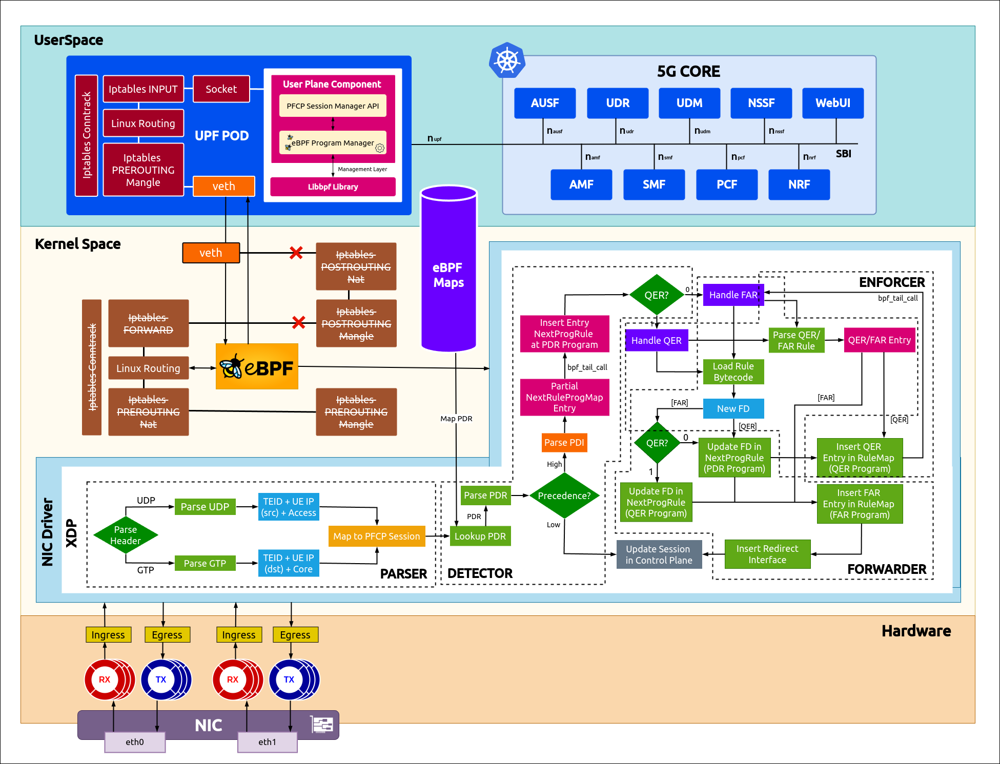
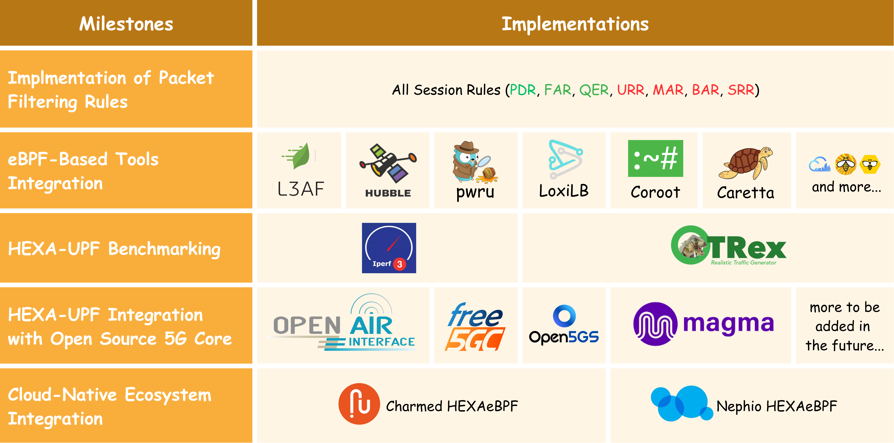

  

<h1 align="left">HEXAeBPF</h1>

**HEXAeBPF** is an open-source, cloud-native, eBPF-defined core solution designed to meet the requirements of advanced 5G and 6G technologies. Its control plane is based on **Aether/SD-Core** (initially an ONF project, now part of Linux Foundation), while the User Plane Function (UPF) is developed in-house. It creates an ecosystem by integrating multiple open-source tools into the 5G framework. This enhances the core solution's capabilities in security, orchestration, observability, and tracing.

## Architecture Design

### Control Plane

HEXAeBPF Control Plane is built on top of Aether/SDCore, ensuring support for 5G Standalone networks. This design provides the necessary flexibility for various network configurations, enhancing the overall adaptability and performance of the system.

### User Plane

HEXAeBPF features an in-house UPF, [HEXA-UPF](https://github.com/coranlabs/HEXA_UPF) with all functionalities implemented in the kernel through eBPF programs. These programs handle data packets at the Data Link Layer, optimizing performance by shifting Packet Forwarding Control Protocol (PFCP) filtering rules (PDR, FAR, QER) to the kernel's XDP hook. This approach improves packet filtering efficiency and offloads processing from the CPU to the kernel, significantly reducing CPU and memory usage.

#### Datapath Packet Processing Modules

- **Parser** analyzes packet headers to extract necessary information about the user equipment (UE), which it sends to the SMF.This component is crucial for enhancing the UPF’s throughput, particularly in handling GTP-U packet forwarding. It supports classification based on IP address and GTP-U/UDP header information, including the ability to modify GTP-U headers based on packet details. The TEID and UE IP are mapped to the PFCP session and relayed to the SMF.

- **Detector** The UPF parses the Packet Detection Rules (PDRs) and checks the precedence of incoming packets to apply the appropriate rules. If a packet is of high precedence,its packet detection information (PDI) is checked, and subsequent programs are called using bpf_tail_call. The file descriptor (FD) of the next program is located within the eBPF maps, facilitating the implementation of further session rules such as PDR, FDR, and QER based on information obtained during the PFCP session establishment and modification requests.

- **Enforcer** Upon parsing the PDI, the system checks for the presence of QER rules within the PFCP message. If present, traffic is directed to the Enforcer; otherwise, it proceeds directly to the Forwarder. The Enforcer applies QER rules to the traffic and then forwards it based on the FD of the subsequent program.

- **Forwarder** The Forwarder applies Forwarding Action Rules (FAR) to the data traffic and returns it to the N4/N6 interface. It also sends session-related control information back to the SMF through the PFCP session.

## Unique Implementation

- Throughput and latency are crucial parameters for connecting massive low-latency devices.
- Kernel-bypass networking techniques (RDMA, DPDK) achieve high performance but face issues with security, isolation, protection, maintainability, and debuggability.
- The kernel networking stack supports these properties but performs poorly in terms of throughput and latency.
- To achieve kernel-bypass-like performance without compromising these capabilities, packet processing operations can be offloaded directly into the kernel using eBPF techniques.
- HEXAeBPF leverages this approach to enable high throughput and low latency without requiring kernel modifications or customized kernel modules, thereby avoiding most of the kernel stack overhead.

### Other Open Source eBPF Based UPFs

- oai-ebpf-upf
- upf-bpf
- eupf

PFCP Rules Support

| PFCP Rules | HEXA_UPF | eupf | oai-ebpf-upf | upf-bpf |
| ---------- | -------- | ---- | ------------ | ------- |
| PDR        | ✔        | ✔    | ✔            | ✔       |
| FAR        | ✔        | ✔    | ✔            | ✔       |
| QER        | ✔        | ✔    | -            | ✔       |
| URR        | -        | x    | x            | x       |
| BAR        | x        | x    | x            | x       |
| MAR        | x        | x    | x            | x       |
| SRR        | x        | x    | x            | x       |

<!-- ### Research Papers -->

<!-- These are the papers which shows the eBPF implementation in 5G Core: -->

## Framework

The HEXAeBPF Architecture is based on the following principles:

- Service Based Architecture (SBA)
- Control and User Plane Separation (CUPS) Mode
- Cloud-Native & Heterogeneous Architecture
- High availability and Security via Kubernetes

## Features

- Network Slicing Capability
- Compliance with 3GPP R-15/16 standards while preparing for the transition to R-17
- eBPF-Defined UPF, HEXA-UPF, compatible with any 3GPP-complaint 5G Core

## Advantages

- Reducing CPU/Memory usage
- Low Latency
- Decreased Packet Loss
- Enhanced Scalability
- Improved Performance and Observability
- Maximized UL and DL Throughput
- Low Kernel Overhead
- In-Kernel Fast Packet Processing
- Flexible Dataplane
- XDP-Based Traffic Handling
- Network Performance Analysis
- User Plane Application Profiling
- Improving UPF Efficiency
- Interaction between eBPF and End-Host Networking in User Plane
- High-Performance Networking

## Getting Started with HEXAeBPF

You can deploy HEXAeBPF easily, check out the [Installation Guide](./docs/installation.md) for further proceeding.

## Project Roadmap

  

### Packet Filtering Rules Support

- [x] PDR
- [x] FAR
- [x] QER
- [ ] URR
- [ ] MAR
- [ ] BAR
- [ ] SRR

### Integration with open source eBPF tools

Integration of varied eBPF-based tools for advanced capabilities in a 5G environment:

- [ ] **L3AF**: A project under the LFN, integrated to manage the lifecycle of multiple eBPF programs within the kernel
- [ ] **pwru**: A project under Cilium, utilized for sophisticated filtering capabilities and aiding in precise network diagnostics space (e.g. XDP Hook)
- [ ] **LoxiLB**: A hyperscale software load balancer designed to balance the cloud-native workload of the 5G ecosystem
- [ ] **Coroot**: An observability tool that converts telemetry data into actionable insights, enabling quick identification and resolution of Network Functions (NF) component issues
- [ ] **Caretta**: A Kubernetes service map tool that traces network traffic between pods and visualizes the network traffic between services in a Kubernetes cluster, providing additional insights into network traffic between NFs
- [ ] **Hubble**: Another project under Cilium, offering deep visibility into the communication and behavior of network services

### Integration with Cloud Native Ecosystems

- **Canonical Juju-Powered Charmed Implementation**: Charmed HEXAeBPF is a highly scalable and reliable core solution featuring model-driven, declarative cluster management with charmed Kubernetes, ensuring high availability.

- **Nephio-driven infrastructure**: Nephio HEXAeBPF will utilize cloud-native technologies and declarative automation to optimize the deployment, management, and scaling of NFs across multiple sites, ensuring quick deployment and efficient resource use across multi-cloud and edge infrastructures.

### Integration of HEXA_UPF with open source 5g Core Control Planes

- OpenAirInterface
- Free5GC
- Open5GS
- Magma

### XDP Mode Support in HEXA_UPF

XDP provides three models to link and attach eBPF programs to a network interface:

(i) **Generic XDP** - It is loaded into the kernel as part of the ordinary network path. It is an easy way, mostly, used to test XDP programs on any (generic) hardware. However, this model does not provide full performance benefits.

(ii) **Native XDP** - Loaded by the network card driver as part of its initial receive path. While it requires the support from the network card driver, this solution offers better performances.

(iii) **Offloaded XDP** - Loaded directly on the network interface card, and it is executed without using the CPU. It requires support from the network interface device.

## Documentation

- The documentation of HEXAeBPF is available on [coranlabs.com](https://www.coranlabs.com/Projects/HEXAeBPF/)
<!-- - [HEXAeBPF Blog](#documentation) -->

## Tutorials

- [Open Source eBPF defined Cloud Native Core Solution: HEXAeBPF](https://youtu.be/2msLlQ9SIi0?si=HjfrhdXNn_o3mUec)
- [HEXAeBPF: eBPF Based 5G Core Solution](https://youtu.be/SO5KMZLKF4I?si=OmNXF-1An1kOGlGZ)

## Community and Support

- **General Discussion**  

  - Check out general discussion about HEXAeBPF [here](https://github.com/coranlabs/HEXAeBPF/discussions)

- **Engagements**  

  - [Isovalent: eBPF Newsletter](https://isovalent-9197153.hs-sites.com/echo-news-episode-60-ebpf-summit-cfp.-netkit-accelerates-cilium?ecid=ACsprvuHHALebZx_3k5FXlwC8Nn8ZH9tiYizqzc0Xu9pZl6jl7Eagaxhtt9i2GP2EqauBxoRkF_f)
  <!-- - [HEXAeBPF in LFN](https://wiki.lfnetworking.org/plugins/servlet/mobile?contentId=136806595#content/view/136806595) -->

<!-- - **Meetups and Presentation**  

  - -->

## License

@ SPDX-License-Identifier: Apache-2.0

@ Copyright 2024 CORAN LABS

This project is under [Apache 2.0](./LICENSE) License

## Code of Conduct

The project has adpoted the [Github Open Source Code of Conduct](./.github/CODE_OF_CONDUCT.md)

## Contributing

Contributions are welcome, you can contribute in many ways: report issues, help us reproduce issues, fix bugs, add features, give us advice on GitHub discussion, and so on.
