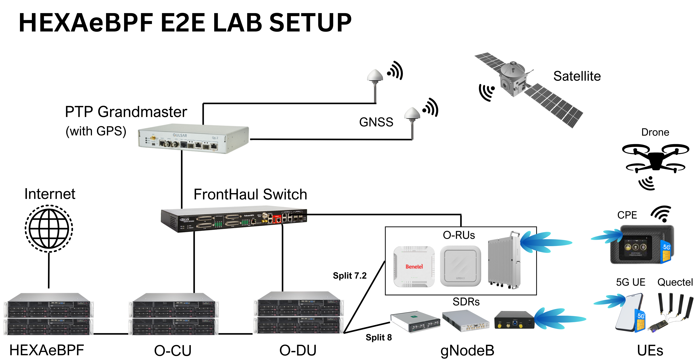

# Installation Guide

## Table of Contents

- [Prerequisites](#prerequisites)
- [Installation](#installation)
- [Deployment](#deployment)
- [Tested Topologies](#tested-topologies)
- [Configuring HEXA_UPF](#configuring-hexa_upf)
- [Checking Pods Status](#checking-pods-status)
- [E2E Connectivity Test via RAN Simulators](#e2e-connectivity-test-via-ran-simulators)
- [NF Logs](#nf-logs)
- [HEXA_UPF Specifications](#hexa_upf-specifications)

## Prerequisites

- **Operating System**: Ubuntu 22.04 LTS or higher (20.04 LTS also supported)
- **Tools & Libraries**:
  - Git 2.45 or later
  - Golang 1.21.1 or later
  - libbpf-dev 1.1.1
  - LLVM 18.1
  - gcc 13.3
  - clang 18.1.0
  - Linux Kernel 5.15.0-25 (not greater than 6.x)
  - bpftool 7.4
  - ebpf/bpf2go 0.15

## Installation

Clone the repository:

```bash
git clone https://github.com/coranlabs/HEXA_UPF.git
```

Clean your environment to ensure no configurations conflict:

```bash
make clean
```

Prepare the necessary directories and files:

```bash
tar -zxvf cord.tgz
cp -r cord ~/
```

## Deployment

Deploy the control plane and user plane with the following commands:

```bash
make hexa-control-plane
make hexaupf
```

To remove all the components related to the 5G core:

```bash
make hexa-clean
```

To clean up all configurations and binaries:

```bash
make clean
```

## Tested Topologies

### RAN

- ARIA (CORANLABS)
- OpenAirInterface (OAI)
- SRSRAN

### Commercial O-RUs

- LiteON
- Benetel 550

### Simulators

- UERANSIM
- gNBSIM
- Packet Rusher

### UEs

- Samsung S22
- Samsung S21FE
- MotoG51 5G
- OnePlus 11 5G
- APAL MiFi
- Quectel RM500Q

### End-to-End Lab Setup

<p align="left">
  <a></a>
</p>

## Configuring HEXA_UPF

You can configure HEXA_UPF as follows:

<details><summary>Configuration Details</summary>

```yaml
configMaps:
  config:
    data:
      config.yml: |
        interface_name: [access, eth0, core]
        api_address: :8080
        pfcp_address: PFCP_ADDRESS:8805
        metrics_address: :9090
        n3_address: 192.168.252.3

podAnnotations:
  k8s.v1.cni.cncf.io/networks: |
    [
      { "name": "access-net",
        "interface": "access",
        "ips": [ "192.168.252.3/24" ],
        "mac": "d6:a4:06:a6:45:6f",
        "dns": {}
      },
      { "name": "core-net",
        "interface": "core",
        "ips": [ "192.168.250.3/24" ],
        "mac": "f6:2b:4f:38:e8:49",
        "dns": {}
      }
    ]
```

</details>

## Checking Pods Status

To ensure all components are running smoothly:

```bash
hexaebpf:~ $ kubectl get pod -n hexa
```

<details><summary>Output</summary>

```txt
NAME                          READY   STATUS    RESTARTS   AGE
hexa-amf-84c576fbc5-kjmzb     1/1     Running   0          5h48m
hexa-ausf-7f8ff65c54-kst7h    1/1     Running   0          5h48m
hexa-core-zookeeper-0         1/1     Running   0          5h48m
hexa-nrf-5f85dbdd98-bf5nk     1/1     Running   0          5h48m
hexa-nssf-7849d565d5-4k9w2    1/1     Running   0          5h48m
hexa-pcf-bfb558c64-gxvg9      1/1     Running   0          5h48m
hexa-smf-644944476b-fvcv5     1/1     Running   0          5h
hexa-udm-664b786dd6-fnbpz     1/1     Running   0          5h48m
hexa-udr-57dc97c5d8-vd8v5     1/1     Running   0          5h48m
hexa-upf-7d4f98f97b-hdclp     1/1     Running   0          5m23s
kafka-0                       1/1     Running   0          5h47m
metricfunc-5dbc48f86f-9n98h   1/1     Running   0          5h48m
mongodb-0                     1/1     Running   0          5h47m
mongodb-1                     1/1     Running   0          5h47m
mongodb-arbiter-0             1/1     Running   0          5h47m
simapp-54c7f7989c-gcdhr       1/1     Running   0          5h48m
webui-66dd7fd9fb-9bb7q        1/1     Running   0          5h48m
```

</details>

## E2E Connectivity Test via RAN Simulators

### UERANSIM Simulator

<details><summary>View RAN Logs</summary>

```log
sudo ../build/nr-gnb -c hexaebpf-gnb.yaml
[2024-05-11 08:28:52.928] [sctp] [info] Trying to establish SCTP connection... (192.168.1.246:38412)
[2024-05-11 08:28:52.931] [sctp] [info] SCTP connection established (192.168.1.246:38412)
[2024-05-11 08:28:52.931] [sctp] [debug] SCTP association setup ascId[4]
[2024-05-11 08:28:52.932] [ngap] [debug] Sending NG Setup Request
[2024-05-11 08:28:52.936] [ngap] [debug] NG Setup Response received
[2024-05-11 08:28:52.936] [ngap] [info] NG Setup procedure is successful
[2024-05-11 08:29:01.860] [rrc] [debug] UE[1] new signal detected
[2024-05-11 08:29:01.860] [rrc] [info] RRC Setup for UE[1]
[2024-05-11 08:29:01.860] [ngap] [debug] Initial NAS message received from UE[1]
[2024-05-11 08:29:02.263] [ngap] [debug] Initial Context Setup Request received
[2024-05-11 08:29:02.659] [ngap] [info] PDU session resource(s) setup for UE[1] count[1]
```

</details>

<details><summary>View UE logs</summary>

```log
sudo ../build/nr-ue -c hexaebpf-ue.yaml
[2024-05-11 08:29:01.860] [nas] [info] UE switches to state [MM-DEREGISTERED/PLMN-SEARCH]
[2024-05-11 08:29:01.860] [rrc] [debug] New signal detected for cell[1], total [1] cells in coverage
[2024-05-11 08:29:01.860] [nas] [info] Selected plmn[001/01]
[2024-05-11 08:29:01.860] [rrc] [info] Selected cell plmn[001/01] tac[1] category[SUITABLE]
[2024-05-11 08:29:01.860] [nas] [info] UE switches to state [MM-DEREGISTERED/PS]
[2024-05-11 08:29:01.860] [nas] [info] UE switches to state [MM-DEREGISTERED/NORMAL-SERVICE]
[2024-05-11 08:29:01.860] [nas] [debug] Initial registration required due to [MM-DEREG-NORMAL-SERVICE]
[2024-05-11 08:29:01.860] [nas] [debug] UAC access attempt is allowed for identity[0], category[MO_sig]
[2024-05-11 08:29:01.860] [nas] [debug] Sending Initial Registration
[2024-05-11 08:29:01.860] [nas] [info] UE switches to state [MM-REGISTER-INITIATED]
[2024-05-11 08:29:01.860] [rrc] [debug] Sending RRC Setup Request
[2024-05-11 08:29:01.860] [rrc] [info] RRC connection established
[2024-05-11 08:29:01.860] [rrc] [info] UE switches to state [RRC-CONNECTED]
[2024-05-11 08:29:01.860] [nas] [info] UE switches to state [CM-CONNECTED]
[2024-05-11 08:29:01.960] [nas] [debug] Authentication Request received
[2024-05-11 08:29:01.960] [nas] [debug] Received SQN [16F3B3F70FC2]
[2024-05-11 08:29:01.960] [nas] [debug] SQN-MS [000000000000]
[2024-05-11 08:29:01.960] [nas] [debug] Sending Authentication Failure due to SQN out of range
[2024-05-11 08:29:01.988] [nas] [debug] Authentication Request received
[2024-05-11 08:29:01.988] [nas] [debug] Received SQN [000000000021]
[2024-05-11 08:29:01.988] [nas] [debug] SQN-MS [000000000000]
[2024-05-11 08:29:02.072] [nas] [debug] Security Mode Command received
[2024-05-11 08:29:02.072] [nas] [debug] Selected integrity[1] ciphering[0]
[2024-05-11 08:29:02.264] [nas] [debug] Registration accept received
[2024-05-11 08:29:02.264] [nas] [info] UE switches to state [MM-REGISTERED/NORMAL-SERVICE]
[2024-05-11 08:29:02.264] [nas] [debug] Sending Registration Complete
[2024-05-11 08:29:02.264] [nas] [info] Initial Registration is successful
[2024-05-11 08:29:02.264] [nas] [debug] Sending PDU Session Establishment Request
[2024-05-11 08:29:02.264] [nas] [debug] UAC access attempt is allowed for identity[0], category[MO_sig]
[2024-05-11 08:29:02.660] [nas] [debug] PDU Session Establishment Accept received
[2024-05-11 08:29:02.660] [nas] [info] PDU Session establishment is successful PSI[1]
[2024-05-11 08:29:02.672] [app] [info] Connection setup for PDU session[1] is successful, TUN interface[uesimtun0, 172.250.237.121] is up.
```

</details>

> [!NOTE]  
> Check out `hexaebpf-ue.yaml` and `hexaebpf-gnb.yaml` for UERANSIM [here](./config/UERANSIM/)

### Packet Rusher

<details><summary>View Packet Rusher Logs</summary>

```log
root@ueransim:/home/ubuntu/PacketRusher# ./packetrusher ue
INFO[0000] Selecting 192.168.5.206 for host 192.168.5.206 as AMF's IP address
INFO[0000] Selecting 192.168.5.204 for host 192.168.5.204 as gNodeB's N3/Data IP address
INFO[0000] Selecting 192.168.5.204 for host 192.168.5.204 as gNodeB's N2/Control IP address
INFO[0000] Loaded config at: /home/ubuntu/PacketRusher/config/config.yml
INFO[0000] PacketRusher version 1.0.1
INFO[0000] ---------------------------------------
INFO[0000] [TESTER] Starting test function: Testing an ue attached with configuration
INFO[0000] [TESTER][UE] Number of UEs: 1
INFO[0000] [TESTER][UE] disableTunnel is false
INFO[0000] [TESTER][GNB] Control interface IP/Port: 192.168.5.204/38412~
INFO[0000] [TESTER][GNB] Data interface IP/Port: 192.168.5.204/2152
INFO[0000] [TESTER][AMF] AMF IP/Port: 192.168.5.206/38412
INFO[0000] ---------------------------------------
INFO[0000] [GNB] SCTP/NGAP service is running
INFO[0000] [GNB] Initiating NG Setup Request
INFO[0000] [GNB][SCTP] Receive message in 0 stream
INFO[0000] [GNB][NGAP] Receive NG Setup Response
INFO[0000] [GNB][AMF] AMF Name: AMF
INFO[0000] [GNB][AMF] State of AMF: Active
INFO[0000] [GNB][AMF] Capacity of AMF: 255
INFO[0000] [GNB][AMF] PLMNs Identities Supported by AMF -- mcc: 001 mnc:01
INFO[0000] [GNB][AMF] List of AMF slices Supported by AMF -- sst:01 sd:010203
INFO[0001] [TESTER] TESTING REGISTRATION USING IMSI 0100007489 UE
INFO[0001] [GNB] Received incoming connection from new UE
INFO[0001] [UE] Initiating Registration
INFO[0001] [UE] Switched from state 0 to state 1
INFO[0001] [GNB][SCTP] Receive message in 0 stream
INFO[0001] [GNB][NGAP] Receive Downlink NAS Transport
INFO[0001] [UE][NAS] Message without security header
INFO[0001] [UE][NAS] Receive Authentication Request
INFO[0001] [UE][NAS][MAC] Authenticity of the authentication request message: OK
INFO[0001] [UE][NAS][SQN] SQN of the authentication request message: VALID
INFO[0001] [UE][NAS] Send authentication response
INFO[0001] [UE] Switched from state 1 to state 2
INFO[0001] [GNB][SCTP] Receive message in 0 stream
INFO[0001] [GNB][NGAP] Receive Downlink NAS Transport
INFO[0001] [UE][NAS] Message with security header
INFO[0001] [UE][NAS] Message with integrity and with NEW 5G NAS SECURITY CONTEXT
INFO[0001] [UE][NAS] successful NAS MAC verification
INFO[0001] [UE][NAS] Receive Security Mode Command
INFO[0001] [UE][NAS] Type of ciphering algorithm is 5G-EA0
INFO[0001] [UE][NAS] Type of integrity protection algorithm is 128-5G-IA1
INFO[0001] [GNB][SCTP] Receive message in 0 stream
INFO[0001] [GNB][NGAP] Receive Initial Context Setup Request
INFO[0001] [GNB][UE] UE Context was created with successful
INFO[0001] [GNB][UE] UE RAN ID 1
INFO[0001] [GNB][UE] UE AMF ID 11114427
INFO[0001] [GNB][UE] UE Mobility Restrict --Plmn-- Mcc: 001 Mnc: 01
INFO[0001] [GNB][UE] UE Masked Imeisv:
INFO[0001] [GNB][UE] Allowed Nssai-- Sst: [01] Sd: [010203]
INFO[0001] [GNB][NGAP][AMF] Send Initial Context Setup Response.
INFO[0001] [GNB] Initiating Initial Context Setup Response
INFO[0001] [GNB][NGAP] No PDU Session to set up in InitialContextSetupResponse.
INFO[0001] [UE][NAS] Message with security header
INFO[0001] [UE][NAS] Message with integrity and ciphered
INFO[0001] [UE][NAS] successful NAS CIPHERING
INFO[0001] [UE][NAS] successful NAS MAC verification
INFO[0001] [UE][NAS] Receive Registration Accept
INFO[0001] [UE][NAS] UE 5G GUTI: &{119 11 [242 0 241 16 202 254 0 0 169 151 206]}
INFO[0001] [UE] Switched from state 2 to state 3
INFO[0001] [UE] Initiating New PDU Session
INFO[0001] [GNB][SCTP] Receive message in 0 stream
INFO[0001] [GNB][NGAP] Receive PDU Session Resource Setup Request
INFO[0001] [GNB][NGAP][UE] PDU Session was created with successful.
INFO[0001] [GNB][NGAP][UE] PDU Session Id: 1
INFO[0001] [GNB][NGAP][UE] NSSAI Selected --- sst: NSSAI was not selected sd: NSSAI was not selected
INFO[0001] [GNB][NGAP][UE] PDU Session Type: ipv4
INFO[0001] [GNB][NGAP][UE] QOS Flow Identifier: 1
INFO[0001] [GNB][NGAP][UE] Uplink Teid: 1770442
INFO[0001] [GNB][NGAP][UE] Downlink Teid: 1
INFO[0001] [GNB][NGAP][UE] Non-Dynamic-5QI: 9
INFO[0001] [GNB][NGAP][UE] Priority Level ARP: 6
INFO[0001] [GNB][NGAP][UE] UPF Address: 192.168.252.3 :2152
INFO[0001] [GNB] Initiating PDU Session Resource Setup Response
INFO[0001] [UE][NAS] Message with security header
INFO[0001] [UE][NAS] Message with integrity and ciphered
INFO[0001] [UE][NAS] successful NAS CIPHERING
INFO[0001] [UE][NAS] successful NAS MAC verification
INFO[0001] [UE][NAS] Receive DL NAS Transport
INFO[0001] [UE][NAS] Receiving PDU Session Establishment Accept
INFO[0001] [UE][NAS] PDU session QoS RULES: [1 0 6 49 50 1 1 250 1]
INFO[0001] [UE][NAS] PDU session DNN: hexa
INFO[0001] [UE][NAS] PDU session NSSAI -- sst: 1 sd: 123
INFO[0001] [UE][NAS] PDU address received: 172.250.237.141
DEBU[0002] [UE][GTP] Setting up GTP Forwarding Action Rule for val0100007489 1 --action 2
DEBU[0002] [UE][GTP] Setting up GTP Forwarding Action Rule for val0100007489 2 --action 2 --hdr-creation 0 1770442 192.168.252.3 2152
DEBU[0002] [UE][GTP] Setting up GTP Packet Detection Rule for val0100007489 1 --pcd 1 --hdr-rm 0 --ue-ipv4 172.250.237.141 --f-teid 1 192.168.5.204 --far-id 1
DEBU[0002] [UE][GTP] Setting Up GTP Packet Detection Rule for val0100007489 2 --pcd 2 --ue-ipv4 172.250.237.141 --far-id 2
INFO[0002] [UE][GTP] Interface val0100007489 has successfully been configured for UE 172.250.237.141
INFO[0002] [UE][GTP] You can do traffic for this UE using VRF vrf0100007489, eg:
INFO[0002] [UE][GTP] sudo ip vrf exec vrf0100007489 iperf3 -c IPERF_SERVER -p PORT -t 9000
^CINFO[0034] [UE] Terminating UE as requested
INFO[0034] [UE] Initiating Release of PDU Session 1
INFO[0035] [UE] Initiating Deregistration
INFO[0035] [UE] Switched from state 3 to state 1
INFO[0035] [UE] UE Terminated
INFO[0035] [UE] Switched from state 1 to state 0
root@ueransim:/home/ubuntu/PacketRusher# ./packetrusher ue
\INFO[0000] Selecting 192.168.5.206 for host 192.168.5.206 as AMF's IP address
INFO[0000] Selecting 192.168.5.204 for host 192.168.5.204 as gNodeB's N3/Data IP address
INFO[0000] Selecting 192.168.5.204 for host 192.168.5.204 as gNodeB's N2/Control IP address
INFO[0000] Loaded config at: /home/ubuntu/PacketRusher/config/config.yml
INFO[0000] PacketRusher version 1.0.1
INFO[0000] ---------------------------------------
INFO[0000] [TESTER] Starting test function: Testing an ue attached with configuration
INFO[0000] [TESTER][UE] Number of UEs: 1
INFO[0000] [TESTER][UE] disableTunnel is false
INFO[0000] [TESTER][GNB] Control interface IP/Port: 192.168.5.204/38412~
INFO[0000] [TESTER][GNB] Data interface IP/Port: 192.168.5.204/2152
INFO[0000] [TESTER][AMF] AMF IP/Port: 192.168.5.206/38412
INFO[0000] ---------------------------------------
INFO[0000] [GNB] SCTP/NGAP service is running
INFO[0000] [GNB] Initiating NG Setup Request
INFO[0000] [GNB][SCTP] Receive message in 0 stream
INFO[0000] [GNB][NGAP] Receive NG Setup Response
INFO[0000] [GNB][AMF] AMF Name: AMF
INFO[0000] [GNB][AMF] State of AMF: Active
INFO[0000] [GNB][AMF] Capacity of AMF: 255
INFO[0000] [GNB][AMF] PLMNs Identities Supported by AMF -- mcc: 001 mnc:01
INFO[0000] [GNB][AMF] List of AMF slices Supported by AMF -- sst:01 sd:010203
INFO[0001] [TESTER] TESTING REGISTRATION USING IMSI 0100007489 UE
INFO[0001] [GNB] Received incoming connection from new UE
INFO[0001] [UE] Initiating Registration
INFO[0001] [UE] Switched from state 0 to state 1
INFO[0001] [GNB][SCTP] Receive message in 0 stream
INFO[0001] [GNB][NGAP] Receive Downlink NAS Transport
INFO[0001] [UE][NAS] Message without security header
INFO[0001] [UE][NAS] Receive Authentication Request
INFO[0001] [UE][NAS][MAC] Authenticity of the authentication request message: OK
INFO[0001] [UE][NAS][SQN] SQN of the authentication request message: VALID
INFO[0001] [UE][NAS] Send authentication response
INFO[0001] [UE] Switched from state 1 to state 2
INFO[0001] [GNB][SCTP] Receive message in 0 stream
INFO[0001] [GNB][NGAP] Receive Downlink NAS Transport
INFO[0001] [UE][NAS] Message with security header
INFO[0001] [UE][NAS] Message with integrity and with NEW 5G NAS SECURITY CONTEXT
INFO[0001] [UE][NAS] successful NAS MAC verification
INFO[0001] [UE][NAS] Receive Security Mode Command
INFO[0001] [UE][NAS] Type of ciphering algorithm is 5G-EA0
INFO[0001] [UE][NAS] Type of integrity protection algorithm is 128-5G-IA1
INFO[0001] [GNB][SCTP] Receive message in 0 stream
INFO[0001] [GNB][NGAP] Receive Initial Context Setup Request
INFO[0001] [GNB][UE] UE Context was created with successful
INFO[0001] [GNB][UE] UE RAN ID 1
INFO[0001] [GNB][UE] UE AMF ID 11114427
INFO[0001] [GNB][UE] UE Mobility Restrict --Plmn-- Mcc: 001 Mnc: 01
INFO[0001] [GNB][UE] UE Masked Imeisv:
INFO[0001] [GNB][UE] Allowed Nssai-- Sst: [01] Sd: [010203]
INFO[0001] [GNB][NGAP][AMF] Send Initial Context Setup Response.
INFO[0001] [GNB] Initiating Initial Context Setup Response
INFO[0001] [GNB][NGAP] No PDU Session to set up in InitialContextSetupResponse.
INFO[0001] [UE][NAS] Message with security header
INFO[0001] [UE][NAS] Message with integrity and ciphered
INFO[0001] [UE][NAS] successful NAS CIPHERING
INFO[0001] [UE][NAS] successful NAS MAC verification
INFO[0001] [UE][NAS] Receive Registration Accept
INFO[0001] [UE][NAS] UE 5G GUTI: &{119 11 [242 0 241 16 202 254 0 0 169 151 206]}
INFO[0001] [UE] Switched from state 2 to state 3
INFO[0001] [UE] Initiating New PDU Session
INFO[0001] [GNB][SCTP] Receive message in 0 stream
INFO[0001] [GNB][NGAP] Receive PDU Session Resource Setup Request
INFO[0001] [GNB][NGAP][UE] PDU Session was created with successful.
INFO[0001] [GNB][NGAP][UE] PDU Session Id: 1
INFO[0001] [GNB][NGAP][UE] NSSAI Selected --- sst: NSSAI was not selected sd: NSSAI was not selected
INFO[0001] [GNB][NGAP][UE] PDU Session Type: ipv4
INFO[0001] [GNB][NGAP][UE] QOS Flow Identifier: 1
INFO[0001] [GNB][NGAP][UE] Uplink Teid: 1770441
INFO[0001] [GNB][NGAP][UE] Downlink Teid: 1
INFO[0001] [GNB][NGAP][UE] Non-Dynamic-5QI: 9
INFO[0001] [GNB][NGAP][UE] Priority Level ARP: 6
INFO[0001] [GNB][NGAP][UE] UPF Address: 192.168.252.3 :2152
INFO[0001] [GNB] Initiating PDU Session Resource Setup Response
INFO[0001] [UE][NAS] Message with security header
INFO[0001] [UE][NAS] Message with integrity and ciphered
INFO[0001] [UE][NAS] successful NAS CIPHERING
INFO[0001] [UE][NAS] successful NAS MAC verification
INFO[0001] [UE][NAS] Receive DL NAS Transport
INFO[0001] [UE][NAS] Receiving PDU Session Establishment Accept
INFO[0001] [UE][NAS] PDU session QoS RULES: [1 0 6 49 50 1 1 250 1]
INFO[0001] [UE][NAS] PDU session DNN: hexa
INFO[0001] [UE][NAS] PDU session NSSAI -- sst: 1 sd: 123
INFO[0001] [UE][NAS] PDU address received: 172.250.237.142
DEBU[0002] [UE][GTP] Setting up GTP Forwarding Action Rule for val0100007489 1 --action 2
DEBU[0002] [UE][GTP] Setting up GTP Forwarding Action Rule for val0100007489 2 --action 2 --hdr-creation 0 1770441 192.168.252.3 2152
DEBU[0002] [UE][GTP] Setting up GTP Packet Detection Rule for val0100007489 1 --pcd 1 --hdr-rm 0 --ue-ipv4 172.250.237.142 --f-teid 1 192.168.5.204 --far-id 1
DEBU[0002] [UE][GTP] Setting Up GTP Packet Detection Rule for val0100007489 2 --pcd 2 --ue-ipv4 172.250.237.142 --far-id 2
INFO[0002] [UE][GTP] Interface val0100007489 has successfully been configured for UE 172.250.237.142
INFO[0002] [UE][GTP] You can do traffic for this UE using VRF vrf0100007489, eg:
INFO[0002] [UE][GTP] sudo ip vrf exec vrf0100007489 iperf3 -c IPERF_SERVER -p PORT -t 9000
```

</details>

> [!NOTE]  
> Check out `hexaebpf_config.yaml` for Packer Rusher [here](./config/Packer_Rusher/hexaebpf_config.yaml)

## NF Logs

For detailed logs of the network functions, refer to the [logs directory](./logs/).

## HEXA_UPF Specifications

For a detailed compatibility of HEXA_UPF with [3GPP specifications](https://github.com/coranlabs/HEXA_UPF)
